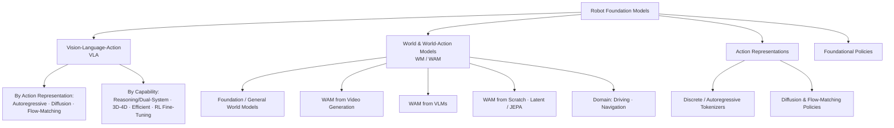

<div align="center">

# 🤖 Awesome World Action Models [](https://awesome.re)

**A curated, continuously-updated reading list of World Action Models (WAM), Vision-Language-Action (VLA) models, and Embodied AI — organized by a survey-grounded taxonomy.**

[](https://github.com/HyperbolicCurve/Awesome-World-Action-Model)
[](#-contributing)
[](LICENSE)
[](https://github.com/HyperbolicCurve/Awesome-World-Action-Model/stargazers)

</div>

---

## Overview

The push toward **general-purpose robots** has produced two converging families of foundation models:

- **Vision-Language-Action (VLA)** models inherit the language grounding and visual understanding of pretrained **Vision-Language Models (VLMs)** and adapt them to emit actions — a scalable route to language-conditioned policies.
- **World Action Models (WAM)** start from a **world model / video backbone** that predicts *how a scene evolves*, and adapt that predictive prior to emit actions — trading the "language→motion" grounding gap for a "dynamics→action" one.

These two families overlap: a WAM built on a pretrained VLM is simultaneously a VLA *and* a WAM. This list maps that landscape with a taxonomy grounded in the recent survey literature (see [Surveys](#-surveys)), so each category has a clear, defensible scope rather than an ad-hoc label.

> [!NOTE]
> **Legend** — 📄 arXiv · 🌐 project page · 💻 code · 📊 dataset/benchmark. Tables are sorted newest-first within each category. The [🆕 Latest Papers](#-latest-papers-auto-updated) section is refreshed daily from arXiv by a [GitHub Action](.github/workflows/update-papers.yml); everything else is hand-curated.

---

## Taxonomy at a Glance



## Table of Contents

- [🔑 Key Definitions](#-key-definitions)
- [🆕 Latest Papers (Auto-updated)](#-latest-papers-auto-updated)
- [📚 Surveys](#-surveys)
- [🤖 Vision-Language-Action (VLA) Models](#-vision-language-action-vla-models)
  - [By Action Representation](#by-action-representation)
    - [Autoregressive / Discrete-Token VLA](#autoregressive--discrete-token-vla)
    - [Diffusion-based VLA](#diffusion-based-vla)
    - [Flow-Matching VLA](#flow-matching-vla)
  - [By Capability](#by-capability)
    - [Reasoning & Dual-System (Fast–Slow) VLA](#reasoning--dualsystem-fastslow-vla)
    - [3D / 4D-Aware VLA](#3d--4d-aware-vla)
    - [Efficient & Real-Time VLA](#efficient--real-time-vla)
    - [RL Fine-Tuning for VLA](#rl-fine-tuning-for-vla)
- [🌎 World & World-Action Models](#-world--world-action-models)
  - [Foundation / General World Models](#foundation--general-world-models)
  - [WAM from Video Generation](#wam-from-video-generation)
  - [WAM from VLMs](#wam-from-vlms)
  - [WAM from Scratch (Latent Dynamics & JEPA)](#wam-from-scratch-latent-dynamics--jepa)
  - [Domain World Models (Driving & Navigation)](#domain-world-models-driving--navigation)
- [🧩 Action Representations & Tokenization](#-action-representations--tokenization)
- [🦾 Foundational Robot Policies](#-foundational-robot-policies)
- [📦 Resources](#-resources)
  - [Datasets](#datasets)
  - [Benchmarks](#benchmarks)
  - [Simulation Platforms](#simulation-platforms)
  - [Tools & Frameworks](#tools--frameworks)
- [📋 Full Paper Index & Baselines](#-full-paper-index--baselines)
- [🤝 Contributing](#-contributing)

---

## 🔑 Key Definitions

| Term | Definition | Canonical reference |
|------|------------|---------------------|
| **Vision-Language-Action (VLA)** | A robot policy that adapts a pretrained **VLM** to map images + language instructions to actions. | [RT-2](https://arxiv.org/abs/2307.15818) (Brohan et al., 2023) |
| **World Model (WM)** | A learned model that predicts future states of an environment (in pixels, latents, or 3D/4D), used for planning, simulation, or representation. | [World Models](https://arxiv.org/abs/1803.10122) (Ha & Schmidhuber, 2018) |
| **World Action Model (WAM)** | A policy that **leverages world-modeling capability (predicting future states) for action prediction** — typically by adapting a video / world-model backbone to emit actions. | [GR-1](https://arxiv.org/abs/2312.13139) (Wu et al., 2023) |

> [!IMPORTANT]
> **VLA ∩ WAM.** The families intersect: a WAM built on a pretrained VLM is *both*. The split in this list is by **what prior the model starts from** — VLM-style vision-language priors (VLA) vs. video/dynamics priors (WAM) — and, within VLA, by **how actions are represented**, the axis most surveys agree is the field's clearest discriminator.

---

## 🆕 Latest Papers (Auto-updated)

> Papers are automatically fetched daily from arXiv. Last updated: 2026-06-23

### VLA

| Paper | Date | Code |
|-------|------|------|
| [InSight: Self-Guided Skill Acquisition via Steerable VLAs](https://arxiv.org/abs/2606.24884v1)<br><small>Maggie Wang, Lars Osterberg et al.</small> | 2026-06-23 |  |
| [G$^3$VLA: Geometric inductive bias for Vision-Language-Action Models](https://arxiv.org/abs/2606.24472v1)<br><small>Yue Peng, Yongzhe Zhao et al.</small> | 2026-06-23 |  |
| [Supervise What Survives: Geometry-Guided VLA Adaptation from Synthetic Robot Videos](https://arxiv.org/abs/2606.24448v1)<br><small>Danze Chen, Yanzhe Chen et al.</small> | 2026-06-23 |  |
| [DriveStack-VLA: Render-Teacher Alignment for BEV-Based DeepStack Vision-Language-Action Model](https://arxiv.org/abs/2606.24051v1)<br><small>Jingke Wang, Zhenru Zhao et al.</small> | 2026-06-23 |  |
| [Neuro-Symbolic Drive: Rule-Grounded Faithful Reasoning for Driving VLAs](https://arxiv.org/abs/2606.23938v1)<br><small>Xiangbo Gao, Xiukun Huang et al.</small> | 2026-06-22 |  |
| [LIBERO-Safety: A Comprehensive Benchmark for Physical and Semantic Safety in Vision-Language-Action Models](https://arxiv.org/abs/2606.23686v1)<br><small>Rongxu Cui, Zongzheng Zhang et al.</small> | 2026-06-22 |  |
| [Flatness Preserves Instruction Following in Vision-Language-Action Models](https://arxiv.org/abs/2606.23641v1)<br><small>Haochen Zhang, Yonatan Bisk</small> | 2026-06-22 |  |
| [dVLA-RL: Reinforcement Learning over Denoising Trajectories for Discrete Diffusion Vision-Language-Action Models](https://arxiv.org/abs/2606.23623v1)<br><small>Yuhao Wu, Yitian Liu et al.</small> | 2026-06-22 |  |
| [RECALL: Recovery Experience Collection for Active Lifelong Learning in Vision-Language-Action Models](https://arxiv.org/abs/2606.23617v1)<br><small>Ulas Berk Karli, Tesca Fitzgerald</small> | 2026-06-22 |  |
| [KEMO: Event-Driven Keyframe Memory for Long-Horizon Robot Manipulation with VLA Policies](https://arxiv.org/abs/2606.23589v1)<br><small>Yihan Zeng, Minghao Ye et al.</small> | 2026-06-22 |  |

### World Model

| Paper | Date | Code |
|-------|------|------|
| [MV-WAM: Manifold-Aware World Action Model with Value Augmentation](https://arxiv.org/abs/2606.21088v1)<br><small>Jintao Chen, Peidong Jia et al.</small> | 2026-06-19 |  |
| [MemoryWAM: Efficient World Action Modeling with Persistent Memory](https://arxiv.org/abs/2606.20562v1)<br><small>Sizhe Yang, Juncheng Mu et al.</small> | 2026-06-18 |  |
| [World Action Models: A Survey](https://arxiv.org/abs/2606.20781v1)<br><small>Qiuhong Shen, Shihua Zhang et al.</small> | 2026-06-18 |  |
| [ImageWAM: Do World Action Models Really Need Video Generation, or Just Image Editing?](https://arxiv.org/abs/2606.19531v1)<br><small>Yuyang Zhang, Wenyao Zhang et al.</small> | 2026-06-17 |  |
| [LaWAM: Latent World Action Models for Efficient Dynamics-Aware Robot Policies](https://arxiv.org/abs/2606.15768v1)<br><small>Jialei Chen, Kai Wang et al.</small> | 2026-06-14 |  |
| [WAM4D: Fast 4D World Action Model via Spatial Register Tokens](https://arxiv.org/abs/2606.14048v1)<br><small>Ying Li, Xiaobao Wei et al.</small> | 2026-06-12 |  |
| [RepWAM: World Action Modeling with Representation Visual-Action Tokenizers](https://arxiv.org/abs/2606.13674v2)<br><small>Junke Wang, Qihang Zhang et al.</small> | 2026-06-11 |  |
| [WEAVER, Better, Faster, Longer: An Effective World Model for Robotic Manipulation](https://arxiv.org/abs/2606.13672v2)<br><small>Arnav Kumar Jain, Yilin Wu et al.</small> | 2026-06-11 |  |
| [NavWAM: A Navigation World Action Model for Goal-Conditioned Visual Navigation](https://arxiv.org/abs/2606.13494v1)<br><small>Daichi Azuma, Taiki Miyanishi et al.</small> | 2026-06-11 |  |
| [EWAM: An Enhanced World Action Model for Closed-Loop Online Adaptation in Embodied Intelligence](https://arxiv.org/abs/2606.12690v1)<br><small>Xin Zhou, Cong Miao</small> | 2026-06-10 |  |

### Policy

| Paper | Date | Code |
|-------|------|------|
| [WAM-RL: World-Action Model Reinforcement Learning with Reconstruction Rewards and Online Video SFT](https://arxiv.org/abs/2606.17906v1)<br><small>Zezhong Qian, Xiaowei Chi et al.</small> | 2026-06-16 |  |
| [Metis: A Generalizable and Efficient World-Action Model for Autonomous Driving and Urban Navigation](https://arxiv.org/abs/2606.15869v1)<br><small>Jingyu Li, Zhe Liu et al.</small> | 2026-06-14 |  |
| [MaskWAM: Unifying Mask Prompting and Prediction for World-Action Models](https://arxiv.org/abs/2606.13515v1)<br><small>Hanyang Yu, Haitao Lin et al.</small> | 2026-06-11 |  |
| [Diffusion Transformer World-Action Model for AV Scene Prediction](https://arxiv.org/abs/2606.12987v1)<br><small>Ruslan Sharifullin, Benjamin Jiang et al.</small> | 2026-06-11 |  |
| [Efficient-WAM: A 1B-Parameter World-Action Model with Low-Cost Future Imagination](https://arxiv.org/abs/2606.10040v2)<br><small>Jiajun Li, Tiecheng Guo et al.</small> | 2026-06-08 |  |
| [AHA-WAM:Asynchronous Horizon-Adaptive World-Action Modeling with Observation-Guided Context Routing](https://arxiv.org/abs/2606.09811v1)<br><small>Jisong Cai, Long Ling et al.</small> | 2026-06-08 |  |

---


## 📚 Surveys

Recent surveys that define the field and motivate the taxonomy used here.

### World & Embodied World Models

| Title | Authors | Year | Links |
|-------|---------|------|-------|
| Understanding World or Predicting Future? A Comprehensive Survey of World Models | Ding et al. | 2024 | [📄](https://arxiv.org/abs/2411.14499) |
| A Comprehensive Survey on World Models for Embodied AI | Li et al. | 2025 | [📄](https://arxiv.org/abs/2510.16732) |
| 3D and 4D World Modeling: A Survey | Kong et al. | 2025 | [📄](https://arxiv.org/abs/2509.07996) |
| Learning Embodied Intelligence from Physical Simulators and World Models | Long et al. | 2025 | [📄](https://arxiv.org/abs/2507.00917) |
| Embodied AI: From LLMs to World Models | Feng et al. | 2025 | [📄](https://arxiv.org/abs/2509.20021) |

### Vision-Language-Action

| Title | Authors | Year | Links |
|-------|---------|------|-------|
| A Survey on Vision-Language-Action Models for Embodied AI | Ma et al. | 2024 | [📄](https://arxiv.org/abs/2405.14093) |
| A Survey on VLA Models: An Action Tokenization Perspective | Zhong et al. | 2025 | [📄](https://arxiv.org/abs/2507.01925) |
| VLA Models: Concepts, Progress, Applications and Challenges | Sapkota et al. | 2025 | [📄](https://arxiv.org/abs/2505.04769) |
| Large VLM-based VLA Models for Robotic Manipulation: A Survey | Shao et al. | 2025 | [📄](https://arxiv.org/abs/2508.13073) |
| Efficient VLA Models for Embodied Manipulation: A Systematic Survey | Guan et al. | 2025 | [📄](https://arxiv.org/abs/2510.17111) |
| VLA Models for Robotics: A Review Towards Real-World Applications | Kawaharazuka et al. | 2025 | [📄](https://arxiv.org/abs/2510.07077) · [🌐](https://vla-survey.github.io/) |

### Foundation Models & Embodied AI

| Title | Authors | Year | Links |
|-------|---------|------|-------|
| Foundation Models in Robotics: Applications, Challenges, and the Future | Firoozi et al. | 2023 | [📄](https://arxiv.org/abs/2312.07843) |
| Toward General-Purpose Robots via Foundation Models: A Survey | Hu et al. | 2023 | [📄](https://arxiv.org/abs/2312.08782) |
| Aligning Cyber Space with Physical World: A Survey on Embodied AI | Liu et al. | 2024 | [📄](https://arxiv.org/abs/2407.06886) |
| Generative AI in Robotic Manipulation: A Survey | Zhang et al. | 2025 | [📄](https://arxiv.org/abs/2503.03464) |
| A Survey of Sim-to-Real Methods in RL with Foundation Models | Da et al. | 2025 | [📄](https://arxiv.org/abs/2502.13187) |

---

## 🤖 Vision-Language-Action (VLA) Models

Following the *action-tokenization* view ([Zhong et al., 2025](https://arxiv.org/abs/2507.01925)), the primary split is by **how actions are represented**; capability-oriented subsections (reasoning, 3D/4D, efficiency, RL) cut across it. A few pre-/non-VLM generalist policies (e.g., RT-1, Octo) are listed alongside their successors to show lineage — see [Foundational Robot Policies](#-foundational-robot-policies) for the strictly non-VLA baselines.

### By Action Representation

#### Autoregressive / Discrete-Token VLA

> Actions are binned into discrete tokens and decoded like text. Simple and VLM-native; high-frequency dexterity needs better tokenizers (see [FAST](https://arxiv.org/abs/2501.09747)).

| Model | Title | Year | Links |
|-------|-------|------|-------|
| **VLA-0** | Building SOTA VLAs with Zero Modification | 2025 | [📄](https://arxiv.org/abs/2510.13054) · [🌐](https://vla0.github.io) |
| **UniVLA** | Unified Vision-Language-Action Model (native multimodal tokens) | 2025 | [📄](https://arxiv.org/abs/2506.19850) · [🌐](https://robertwyq.github.io/univla.github.io/) |
| **π0-FAST** | Autoregressive π0 variant using the FAST action tokenizer | 2025 | [📄](https://arxiv.org/abs/2501.09747) · [🌐](https://www.pi.website/research/fast) |
| **OpenVLA** | An Open-Source Vision-Language-Action Model | 2024 | [📄](https://arxiv.org/abs/2406.09246) · [🌐](https://openvla.github.io) · [💻](https://github.com/openvla/openvla) |
| **RT-2** | VLA Models Transfer Web Knowledge to Robotic Control | 2023 | [📄](https://arxiv.org/abs/2307.15818) · [🌐](https://robotics-transformer2.github.io) |
| **RT-1** | Robotics Transformer for Real-World Control at Scale | 2022 | [📄](https://arxiv.org/abs/2212.06817) · [🌐](https://robotics-transformer1.github.io) · [💻](https://github.com/google-research/robotics_transformer) |

#### Diffusion-based VLA

> A diffusion action head denoises continuous action chunks conditioned on vision-language features.

| Model | Title | Year | Links |
|-------|-------|------|-------|
| **RoboVLMs** | Towards Generalist Robot Policies: What Matters in Building VLAs | 2024 | [📄](https://arxiv.org/abs/2412.14058) · [🌐](https://robovlms.github.io) |
| **CogACT** | A Foundational VLA Model for Synergizing Cognition and Action | 2024 | [📄](https://arxiv.org/abs/2411.19650) |
| **TinyVLA** | Fast, Data-Efficient VLA Models for Manipulation | 2024 | [📄](https://arxiv.org/abs/2409.12514) · [🌐](https://tiny-vla.github.io) |
| **Octo** | An Open-Source Generalist Robot Policy | 2024 | [📄](https://arxiv.org/abs/2405.12213) · [🌐](https://octo-models.github.io) · [💻](https://github.com/octo-models/octo) |

#### Flow-Matching VLA

> A conditional flow/vector field transports noise to action chunks — the dominant head for current SOTA generalist VLAs.

| Model | Title | Year | Links |
|-------|-------|------|-------|
| **π*0.6** | A VLA That Learns From Experience | 2025 | [📄](https://arxiv.org/abs/2511.14759) · [🌐](https://www.pi.website/blog/pistar06) |
| **X-VLA** | Soft-Prompted Transformer as a Scalable Cross-Embodiment VLA | 2025 | [📄](https://arxiv.org/abs/2510.10274) · [🌐](https://thu-air-dream.github.io/X-VLA/) · [💻](https://github.com/2toinf/X-VLA) |
| **SmolVLA** | A VLA for Affordable and Efficient Robotics | 2025 | [📄](https://arxiv.org/abs/2506.01844) · [💻](https://github.com/huggingface/lerobot) |
| **π0.5** | A VLA with Open-World Generalization | 2025 | [📄](https://arxiv.org/abs/2504.16054) · [🌐](https://www.pi.website/blog/pi05) |
| **Gemini Robotics** | Bringing AI into the Physical World | 2025 | [📄](https://arxiv.org/abs/2503.20020) · [🌐](https://deepmind.google/models/gemini-robotics/) |
| **GR00T N1** | An Open Foundation Model for Generalist Humanoid Robots | 2025 | [📄](https://arxiv.org/abs/2503.14734) · [💻](https://github.com/NVIDIA/Isaac-GR00T) |
| **π0** | A Vision-Language-Action Flow Model for General Robot Control | 2024 | [📄](https://arxiv.org/abs/2410.24164) · [🌐](https://www.pi.website/blog/pi0) |

### By Capability

#### Reasoning & Dual-System (Fast–Slow) VLA

> Explicit chain-of-thought / embodied reasoning, or a slow System-2 planner paired with a fast System-1 controller.

| Model | Title | Year | Links |
|-------|-------|------|-------|
| **ACoT-VLA** | Action Chain-of-Thought for VLA Models | 2026 | [📄](https://arxiv.org/abs/2601.11404) · [💻](https://github.com/AgibotTech/ACoT-VLA) |
| **Gemini Robotics 1.5** | Embodied Reasoning & Motion Transfer | 2025 | [📄](https://arxiv.org/abs/2510.03342) |
| **ThinkAct** | VLA Reasoning via Reinforced Visual Latent Planning | 2025 | [📄](https://arxiv.org/abs/2507.16815) |
| **OpenHelix** | A Short Survey & Open-Source Dual-System VLA | 2025 | [📄](https://arxiv.org/abs/2505.03912) |
| **CoT-VLA** | Visual Chain-of-Thought Reasoning for VLA | 2025 | [📄](https://arxiv.org/abs/2503.22020) |

#### 3D / 4D-Aware VLA

> Policies that reason over explicit 3D/4D structure (point clouds, occupancy, predicted future frames) rather than 2D images alone. (VoxPoser, a zero-shot 3D value-map planner, lives under [Foundational Robot Policies](#-foundational-robot-policies).)

| Model | Title | Year | Links |
|-------|-------|------|-------|
| **3D-VLA** | A 3D Vision-Language-Action Generative World Model | 2024 | [📄](https://arxiv.org/abs/2403.09631) |

#### Efficient & Real-Time VLA

> Compression, caching, parallel decoding, and distillation to make VLAs small and fast enough for real-time / edge control ([Guan et al., 2025](https://arxiv.org/abs/2510.17111)).

| Model | Title | Year | Links |
|-------|-------|------|-------|
| **FASTER** | Rethinking Real-Time Flow VLAs | 2026 | [📄](https://arxiv.org/abs/2603.19199) |
| **RTC** | Real-Time Chunking: Running VLAs at Real-Time Speed | 2025 | [📄](https://arxiv.org/abs/2510.26742) |
| **VLA-Adapter** | A Tiny-Scale VLA Paradigm | 2025 | [📄](https://arxiv.org/abs/2509.09372) |
| **OpenVLA-OFT** | Fine-Tuning VLAs: Optimizing Speed and Success | 2025 | [📄](https://arxiv.org/abs/2502.19645) · [🌐](https://openvla-oft.github.io) |
| **TinyVLA** | Fast, Data-Efficient VLA Models | 2024 | [📄](https://arxiv.org/abs/2409.12514) · [🌐](https://tiny-vla.github.io) |

#### RL Fine-Tuning for VLA

> Reinforcement learning (often on top of flow-/diffusion-based VLAs) to improve over imitation-only training.

| Model | Title | Year | Links |
|-------|-------|------|-------|
| **π_RL** | Online RL Fine-Tuning for Flow-based VLAs | 2025 | [📄](https://arxiv.org/abs/2510.25889) |
| **SimpleVLA-RL** | Scaling VLA Training via Reinforcement Learning | 2025 | [📄](https://arxiv.org/abs/2509.09674) |

---

## 🌎 World & World-Action Models

Organized by **what the model predicts and how it is built**, following the embodied-world-model taxonomy of [Li et al., 2025](https://arxiv.org/abs/2510.16732) and the WAM split popularized by [awesome-vla-wam](https://github.com/DravenALG/awesome-vla-wam).

### General World Models

> General-purpose models of environment dynamics — spanning classical latent world models for model-based RL (World Models, DreamerV3) and modern large-scale video / foundation world models — used for planning, neural simulation, or as backbones for WAMs.

| Model | Title | Year | Links |
|-------|-------|------|-------|
| **Cosmos** | World Foundation Model Platform for Physical AI | 2025 | [📄](https://arxiv.org/abs/2501.03575) · [🌐](https://developer.nvidia.com/cosmos) |
| **V-JEPA 2** | Self-Supervised Video Models Enable Understanding, Prediction & Planning | 2025 | [📄](https://arxiv.org/abs/2506.09985) |
| **iVideoGPT** | Interactive VideoGPTs are Scalable World Models | 2024 | [📄](https://arxiv.org/abs/2405.15223) |
| **Genie** | Generative Interactive Environments | 2024 | [📄](https://arxiv.org/abs/2402.15391) |
| **DreamerV3** | Mastering Diverse Domains through World Models | 2023 | [📄](https://arxiv.org/abs/2301.04104) · [💻](https://github.com/danijar/dreamerv3) |
| **UniSim** | Learning Interactive Real-World Simulators | 2023 | [📄](https://arxiv.org/abs/2310.06114) |
| **World Models** | Recurrent latent world model + controller (origin of the term) | 2018 | [📄](https://arxiv.org/abs/1803.10122) |

### WAM from Video Generation

> A (text-/image-conditioned) video generator imagines future frames; actions are recovered via an inverse-dynamics / action head.

| Model | Title | Year | Links |
|-------|-------|------|-------|
| **DreamZero** | World Action Models are Zero-shot Policies | 2026 | [📄](https://arxiv.org/abs/2602.15922) · [🌐](https://dreamzero0.github.io) |
| **DiT4DiT** | Jointly Modeling Video Dynamics and Actions | 2026 | [📄](https://arxiv.org/abs/2603.10448) |
| **Cosmos Policy** | Fine-Tuning Video Models for Visuomotor Control & Planning | 2026 | [📄](https://arxiv.org/abs/2601.16163) · [🌐](https://developer.nvidia.com/cosmos) |
| **Video2Act** | A Dual-System Video Diffusion Policy | 2025 | [📄](https://arxiv.org/abs/2512.03044) |
| **GR-2** | A Generative Video-Language-Action Model with Web-Scale Knowledge | 2024 | [📄](https://arxiv.org/abs/2410.06158) |
| **GR-1** | Large-Scale Video Generative Pre-training for Visual Robot Manipulation | 2023 | [📄](https://arxiv.org/abs/2312.13139) |

### WAM from VLMs

> A pretrained VLM is turned into a world model (e.g., predicting goal images / object-centric futures) that then drives action.

| Model | Title | Year | Links |
|-------|-------|------|-------|
| **DreamVLA** | A VLA Model Dreamed with Comprehensive World Knowledge | 2025 | [📄](https://arxiv.org/abs/2507.04447) |
| **Goal-VLA** | Image-Generative VLMs as Object-Centric World Models for VLA | 2025 | [📄](https://arxiv.org/abs/2506.23919) |

### Latent & JEPA World Models

> Self-supervised *latent* predictive models (non-reconstructive joint-embedding / JEPA). The JEPA foundations (I-JEPA) learn to predict in representation space; the action-conditioned variant (V-JEPA 2-AC) turns that prior into a world model for planning.

| Model | Title | Year | Links |
|-------|-------|------|-------|
| **V-JEPA 2-AC** | Action-Conditioned Latent World Model for Zero-Shot Planning | 2025 | [📄](https://arxiv.org/abs/2506.09985) |
| **I-JEPA** | Image-based Joint-Embedding Predictive Architecture (representation foundation) | 2023 | [📄](https://arxiv.org/abs/2301.08243) |

### Domain World Models (Driving & Navigation)

| Model | Title | Year | Links |
|-------|-------|------|-------|
| **GAIA-2** | A Controllable Multi-View Generative World Model for Autonomous Driving | 2025 | [📄](https://arxiv.org/abs/2503.20523) |
| **Navigation World Models** | Conditional Diffusion Transformer for Navigation | 2024 | [📄](https://arxiv.org/abs/2412.03572) |
| **GAIA-1** | A Generative World Model for Autonomous Driving | 2023 | [📄](https://arxiv.org/abs/2309.17080) |

---

## 🧩 Action Representations & Tokenization

Building blocks shared across VLA and WAM policies — how continuous actions become learnable targets.

### Discrete / Autoregressive Tokenizers

| Method | Title | Year | Links |
|--------|-------|------|-------|
| **FAST** | Efficient (DCT-based) Action Tokenization for VLAs | 2025 | [📄](https://arxiv.org/abs/2501.09747) · [🌐](https://www.pi.website/research/fast) |
| **BeT** | Behavior Transformers: Cloning *k* Modes with One Stone | 2022 | [📄](https://arxiv.org/abs/2206.11251) |

### Continuous & Chunked Action Policies

> Heads that emit continuous action chunks — by denoising diffusion (Diffusion Policy) or by chunked sequence prediction with a CVAE (ACT). Flow-matching heads (π0, SmolVLA, …) are listed with their models under [Flow-Matching VLA](#flow-matching-vla).

| Method | Title | Year | Links |
|--------|-------|------|-------|
| **Diffusion Policy** | Visuomotor Policy Learning via Action Diffusion | 2023 | [📄](https://arxiv.org/abs/2303.04137) · [🌐](https://diffusion-policy.cs.columbia.edu) |
| **ACT / ALOHA** | Action Chunking with Transformers | 2023 | [📄](https://arxiv.org/abs/2304.13705) · [🌐](https://tonyzhaozh.github.io/aloha/) |

---

## 🦾 Foundational Robot Policies

Non-VLA policies and planners that remain standard baselines in the experimental tables of the papers above. (Diffusion Policy, ACT, and BeT are described under [Action Representations](#-action-representations--tokenization).)

| Method | Title | Year | Links |
|--------|-------|------|-------|
| **CrossFormer** | Scaling Cross-Embodied Learning: One Policy for Manipulation, Navigation, Locomotion & Flight | 2024 | [📄](https://arxiv.org/abs/2408.11812) · [💻](https://github.com/rail-berkeley/crossformer) |
| **RoboFlamingo** | Vision-Language Foundation Models as Effective Robot Imitators | 2023 | [📄](https://arxiv.org/abs/2311.01378) · [💻](https://github.com/RoboFlamingo/RoboFlamingo) |
| **VoxPoser** | Composable 3D Value Maps for Robotic Manipulation (zero-shot LLM + 3D planner) | 2023 | [📄](https://arxiv.org/abs/2307.05973) · [🌐](https://voxposer.github.io) |
| **RT-1** | Robotics Transformer for Real-World Control at Scale | 2022 | [📄](https://arxiv.org/abs/2212.06817) |

---

## 📦 Resources

### Datasets

| Name | Description | Scale | Links |
|------|-------------|-------|-------|
| **Open X-Embodiment** | Cross-embodiment aggregation behind the RT-X models | 1M+ traj · 22 embodiments | [📄](https://arxiv.org/abs/2310.08864) · [🌐](https://robotics-transformer-x.github.io/) |
| **AgiBot World** | Large-scale real-world manipulation (Colosseo) | 1M+ traj · 217 tasks | [📄](https://arxiv.org/abs/2503.06669) · [🌐](https://agibot-world.com/) |
| **DROID** | In-the-wild Franka manipulation across 3 continents | 76K traj · 564 scenes | [📄](https://arxiv.org/abs/2403.12945) · [🌐](https://droid-dataset.github.io/) |
| **RoboMIND** | Multi-embodiment teleop incl. labeled failures | 107K traj · 479 tasks | [📄](https://arxiv.org/abs/2412.13877) · [🌐](https://x-humanoid-robomind.github.io/) |
| **BridgeData V2** | WidowX manipulation w/ language + goal images | 60K traj · 24 envs | [📄](https://arxiv.org/abs/2308.12952) · [🌐](https://rail-berkeley.github.io/bridgedata/) |
| **RH20T** | Contact-rich skills w/ paired human demos | 110K+ seq · 147 tasks | [📄](https://arxiv.org/abs/2307.00595) · [🌐](https://rh20t.github.io/) |
| **Ego-Exo4D** | Simultaneous ego + exo video of skilled activity | 1,286 hrs | [📄](https://arxiv.org/abs/2311.18259) · [🌐](https://ego-exo4d-data.org/) |
| **Ego4D** | Massive egocentric daily-life video | 3,670 hrs | [📄](https://arxiv.org/abs/2110.07058) · [🌐](https://ego4d-data.org/) |

### Benchmarks

| Name | Description | Links |
|------|-------------|-------|
| **LIBERO** | Lifelong robot-learning, 130 manipulation tasks (de-facto VLA eval) | [📄](https://arxiv.org/abs/2306.03310) · [💻](https://github.com/Lifelong-Robot-Learning/LIBERO) |
| **CALVIN** | Long-horizon language-conditioned manipulation | [📄](https://arxiv.org/abs/2112.03227) · [💻](https://github.com/mees/calvin) |
| **SimplerEnv** | Real-to-sim evaluation for manipulation policies | [📄](https://arxiv.org/abs/2405.05941) · [🌐](https://simpler-env.github.io/) |
| **RoboCasa** | Large-scale kitchen simulation (100 tasks) | [📄](https://arxiv.org/abs/2406.02523) · [🌐](https://robocasa.ai/) |
| **VLABench** | World-knowledge & long-horizon language tasks | [📄](https://arxiv.org/abs/2412.18194) · [🌐](https://vlabench.github.io/) |
| **ManiSkill3** | GPU-parallel manipulation (30K+ FPS) | [📄](https://arxiv.org/abs/2410.00425) · [🌐](https://maniskill.ai/) |
| **THE COLOSSEUM** | Robustness under 14 environmental perturbations | [📄](https://arxiv.org/abs/2402.08191) · [🌐](https://robot-colosseum.github.io/) |
| **RoboArena** | Distributed crowd-sourced *real-world* policy eval | [📄](https://arxiv.org/abs/2506.18123) · [🌐](https://robo-arena.github.io/) |
| **Meta-World** | 50 tabletop tasks for multi-task / meta-RL | [📄](https://arxiv.org/abs/1910.10897) · [💻](https://github.com/Farama-Foundation/Metaworld) |
| **RLBench** | 100 hand-designed manipulation tasks | [📄](https://arxiv.org/abs/1909.12271) · [💻](https://github.com/stepjam/RLBench) |

### Simulation Platforms

| Name | Description | Links |
|------|-------------|-------|
| **Isaac Sim / Isaac Lab** | GPU-native robotics sim + RL/IL framework (Omniverse/USD) | [🌐](https://github.com/isaac-sim/IsaacLab) |
| **MuJoCo / MJX** | Standard rigid-body engine + JAX/XLA parallel variant | [🌐](https://github.com/google-deepmind/mujoco) |
| **Genesis** | Generative, multi-solver physics platform (up to ~43M FPS) | [🌐](https://github.com/Genesis-Embodied-AI/Genesis) |
| **ManiSkill** | GPU-parallel manipulation simulator on SAPIEN | [🌐](https://github.com/haosulab/ManiSkill) |
| **SAPIEN** | Part-level articulated-object simulator (PartNet-Mobility) | [📄](https://arxiv.org/abs/2003.08515) · [🌐](https://sapien.ucsd.edu/) |
| **Habitat** | Photorealistic indoor navigation & rearrangement | [🌐](https://github.com/facebookresearch/habitat-sim) |
| **ThreeDWorld** | Multimodal Unity3D sim (vision + audio + physics) | [📄](https://arxiv.org/abs/2007.04954) · [🌐](https://www.threedworld.org/) |
| **Newton** | Open, differentiable GPU physics engine (NVIDIA + DeepMind + Disney) | [🌐](https://github.com/newton-physics/newton) |

### Tools & Frameworks

| Name | Description | Links |
|------|-------------|-------|
| **LeRobot** | End-to-end PyTorch robot-learning library + datasets + low-cost HW | [📄](https://arxiv.org/abs/2602.22818) · [💻](https://github.com/huggingface/lerobot) |
| **openpi** | Open models & training/inference for π0, π0-FAST, π0.5 | [💻](https://github.com/Physical-Intelligence/openpi) |
| **Isaac GR00T** | Open humanoid foundation-model framework + checkpoints | [💻](https://github.com/NVIDIA/Isaac-GR00T) |
| **OpenVLA** | Training / LoRA fine-tuning for the 7B OpenVLA model | [💻](https://github.com/openvla/openvla) |
| **Octo** | JAX/Flax generalist transformer policy on OXE | [💻](https://github.com/octo-models/octo) |
| **robomimic / robosuite** | Learning-from-demonstration framework + MuJoCo manipulation sim | [💻](https://github.com/ARISE-Initiative/robomimic) |
| **HIL-SERL** | Human-in-the-loop, sample-efficient real-world RL | [💻](https://github.com/rail-berkeley/hil-serl) |

---

## 📋 Full Paper Index & Baselines

<details>
<summary><b>📊 Click to expand the complete paper list and baseline methods</b></summary>

The curated tables above highlight landmark and representative work. For the exhaustive, auto-maintained index and the baseline methods extracted from experimental tables, see:

- 📋 **[Complete Paper List](docs/all-papers.md)** — full index, sorted newest-first
- 📊 **[Baseline Methods](docs/baselines.md)** — comparison methods from major VLA/WAM papers

### Quick Reference (common baselines)

| Family | Key baselines |
|--------|---------------|
| **VLA** | RT-1, RT-2, OpenVLA, Octo, π0, π0.5, X-VLA, UniVLA, SmolVLA |
| **Policy** | Diffusion Policy, ACT, BeT, RoboFlamingo, CrossFormer |
| **World Model** | DreamerV3, I-JEPA, V-JEPA 2, Genie, Cosmos, GR-1/GR-2 |

</details>

---

## 🤝 Contributing

Contributions are very welcome! To add or fix a paper:

1. **Add a paper** — open a PR placing it in the appropriate category (keep tables sorted newest-first), or open an issue with the arXiv link.
2. **Fix an error** — submit a PR with the correction.
3. **New papers appear automatically** — the [🆕 Latest Papers](#-latest-papers-auto-updated) section is regenerated daily by the scraper; do not hand-edit it.

To run the discovery pipeline locally:

```bash
pip install -r requirements.txt
python scripts/arxiv_scraper.py --max-results 50 --days-back 30   # writes data/papers.json
python scripts/update_readme.py                                  # refreshes the auto section
```

## License

Released under the [MIT License](LICENSE).

## Acknowledgments

Inspired by [awesome-vla-wam](https://github.com/DravenALG/awesome-vla-wam), [awesome-physical-ai](https://github.com/keon/awesome-physical-ai), and [awesome-vla-study](https://github.com/MilkClouds/awesome-vla-study). Taxonomy grounded in the surveys listed [above](#-surveys).

---

<div align="center">
<b>If you find this repository useful, please consider giving it a ⭐</b>
</div>
